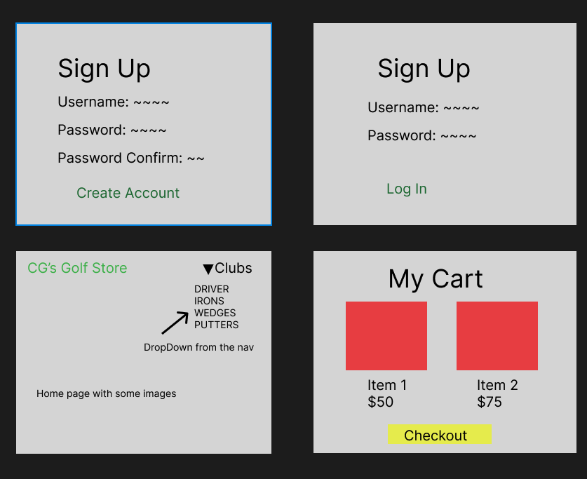
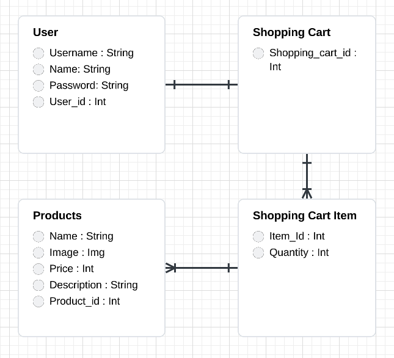

# CG's Golf Store
CG's Golf Store will be an online ECommerce Store that will sell every kind of golf club imaginable. 

## Technologies Used
- HTML
- CSS
- JavaScript
- Python
- Django
- PostgresQL
- Bootstrap

## User Stories
#### As an User I Want The Ability to:
- Create an account
- Log in to my account
- Change my Password
- Shop throughout the store
- Add products to my cart
- View my cart of items I added
- Edit and Delete items in my cart
- Check Out and "purchase" products
- Log out of my account

## Wireframes

## ERD

## Reach Goals
- Add a used page where users can upload used clubs for sale
- Add a real checkout process
## General Approach

## Major Hurdles
- Using JavaScript to make the buttons in cart functional